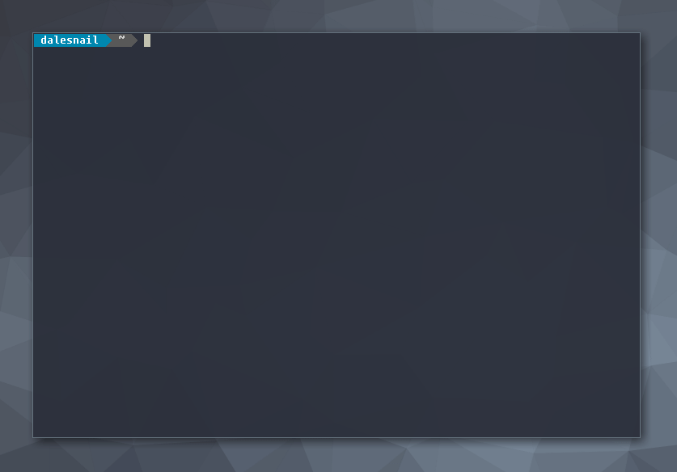

   
  Automated customization for termite and urxvt terminals

# Update
Will be updating this to work with xst. Should be an easy adaptation to make, since xst is set up to use your .Xresources file.  

# Install

- `git clone https://github.com/dalesnail/themite.git` into ~/.config

- cd ~/.config/themite

- sudo setup.py

__Important__

- Make sure your termite config is stored at "/.config/termite/config", and your themes are stored in ~/.config/themite/themes/"Whatever terminal you use", __WILL NOT__ work in other config locations unless you edit the python script. I am working to make this more universal, but for now stick with this format. 

- I have set it up recently to be able to replace only colors with theme swaps, to keep fonts and other non color elements constant. But note, for URXVT color blocks in both Xresources and themes need to begin with "! special" and end with "! end-colors". In termite your color block should begin with "[colors]"

- Theme files names should be formatted as "config.themename" for termite, and ".Xresources.themename" for URXVT

__Usage__

Arguments have been added to the script here to make for quicker theme swapping. 

- -ttheme and -utheme - This will change the theme for termite(-ttheme) and URXVT(utheme), if you use "Random" a random theme will be chosen. Format: 'themite -ttheme "ProfileName"'

- -list - This will list the available themes, t for termite u for URXVT. e.g. "themite -list t"

- -font - this will put you into the prompt for a new font, same as above, t for termite u for urxvt. e.g. "themite -font t"

Enjoy!

----------------------------------------------------------------------------------------------

